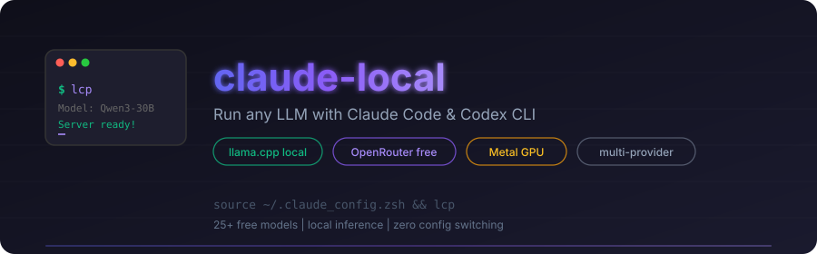

<p align="center">
  
</p>

<p align="center">
  <strong>Run any LLM with Claude Code & Codex CLI — local or cloud, free or paid.</strong>
</p>

<p align="center">
  <a href="#option-1-local-with-llamacpp">Local</a> &bull;
  <a href="#option-2-openrouter-free-models">Free Cloud</a> &bull;
  <a href="#option-3-openrouter-paid-models">Paid Cloud</a> &bull;
  <a href="#browsing-all-openrouter-models">Model Browser</a> &bull;
  <a href="#troubleshooting">Troubleshooting</a>
</p>

---

Three ways to use LLMs with **Claude Code** or **OpenAI Codex CLI**:
1. **Local** — llama.cpp with Metal GPU (free, private, offline)
2. **OpenRouter Free** — 25+ cloud models at $0 cost
3. **OpenRouter Paid** — Claude, GPT, Gemini, etc.

Plus a **model browser** (`or-models`) to search all 300+ OpenRouter models with live pricing, a **session observability suite** (`llp-*`) with metrics and provider recommendations, extracted **lib/ Python helpers** for maintainability, and automated **preflight checks** on source.

---

## Install

> **Platform**: macOS with Apple Silicon (M1–M4). The local llama.cpp option uses Metal GPU. OpenRouter options work on any platform.

```bash
# Clone the repo
git clone https://github.com/sriinnu/claude-local.git
cd claude-local

# Copy the shell config
cp claude_config.zsh ~/.claude_config.zsh

# Add to your ~/.zshrc so it loads every shell
echo 'source ~/.claude_config.zsh' >> ~/.zshrc
source ~/.claude_config.zsh
```

### API keys (required for cloud options)

Create `~/.env.claude` with your keys:

```bash
# OpenRouter (free signup at https://openrouter.ai — needed for orf/openrouter)
export OPENROUTER_API_KEY="sk-or-v1-your-key-here"

# Optional: other providers
export ZAI_API_KEY="your-zai-key"
export MINIMAX_API_KEY="your-minimax-key"
export DEEPSEEK_API_KEY="your-deepseek-key"

# Vercel AI Gateway (key from the Vercel dashboard → AI Gateway → API Keys)
# Anthropic-native gateway to 280+ models. Needed for vai/vai-models.
export AI_GATEWAY_API_KEY="vck_your-key-here"
```

> **Just want free cloud models?** Set up the OpenRouter key above and skip straight to [Option 2](#option-2-openrouter-free-models) — no build or downloads needed.

## Quick Start

```bash
source ~/.claude_config.zsh
```

Then pick your mode:

```bash
# Local (llama.cpp) — free, private, offline
lcp                                         # interactive model picker
lcp gemma4                                  # fuzzy match a downloaded model
hf                                          # search HF Hub → pick → download → launch
hf qwen3 coder                              # search with keywords

# OpenRouter free models — $0, cloud-hosted
orf                                         # interactive picker (25+ models)
orf qwen/qwen3-coder:free                   # use a specific free model

# OpenRouter paid — use any premium model
openrouter                                  # hardcoded to Claude Opus/Sonnet/Haiku
or-models --paid --use                      # full paid picker with live pricing

# Browse all OpenRouter models with live pricing
or-models                                   # browse all 300+ models
or-models gemma-4                           # search by name
or-models --free                            # free models only
or-models gemma-4 --use                     # search, pick, launch

# Observability & routing
llp-which                                   # intelligent provider recommendation
llp-stats                                   # session dashboard (error rates, durations)
llp-history                                 # raw session log (last 10)
llp-quick                                   # launch best free model immediately
llp-reset                                   # clear session log
```

---

## Option 1: Local with llama.cpp

### Prerequisites

- macOS with Apple Silicon (M1/M2/M3/M4)
- Homebrew, cmake (`brew install cmake`), Git
- `~/.local/bin` in your PATH (add `export PATH="$HOME/.local/bin:$PATH"` to `~/.zshrc` if not)
- Python 3 + `huggingface-hub` for downloading models: `pip install huggingface-hub`

### Build from source

```bash
cd ~/claude-local
git clone https://github.com/ggml-org/llama.cpp.git
cd llama.cpp

# Build with Metal GPU support
cmake -B build -DGGML_METAL=ON -DLLAMA_CURL=ON
cmake --build build --config Release -j$(sysctl -n hw.ncpu)

# Make the binaries accessible
mkdir -p ~/.local/bin
ln -sf "$(pwd)/build/bin/llama-server" ~/.local/bin/llama-server
ln -sf "$(pwd)/build/bin/llama-cli" ~/.local/bin/llama-cli

# Verify
llama-server --version
```

### Download GGUF models

Models are GGUF files from HuggingFace. Best sources:

- **[unsloth](https://huggingface.co/unsloth)** — High-quality GGUFs for most popular models
- **[bartowski](https://huggingface.co/bartowski)** — Wide variety, fast uploads of new models
- **[lmstudio-community](https://huggingface.co/lmstudio-community)** — Reliable GGUFs

**Download methods:**

```bash
# Create models directory first
mkdir -p models

# Method 1: lcp helper (requires huggingface-hub)
lcp --pull unsloth/Qwen3-30B-A3B-GGUF Qwen3-30B-A3B-Q4_K_M.gguf

# Method 2: huggingface-cli
pip install huggingface-hub
huggingface-cli download unsloth/Qwen3-30B-A3B-GGUF Qwen3-30B-A3B-Q4_K_M.gguf \
  --local-dir ./models

# Method 3: curl
curl -L -o models/Qwen3-4B-Q4_K_M.gguf \
  "https://huggingface.co/unsloth/Qwen3-4B-GGUF/resolve/main/Qwen3-4B-Q4_K_M.gguf"
```

### RAM guide

| Your RAM | Max model size | Recommended |
|----------|---------------|-------------|
| 8GB      | ~4GB          | Qwen3-4B Q4_K_M |
| 16GB     | ~10GB         | Qwen3-8B Q4_K_M |
| 32GB     | ~22GB         | Qwen3-30B-A3B Q4_K_M, Gemma-4-26B-A4B UD-Q5_K_XL |
| 36GB     | ~26GB         | Gemma-4-26B-A4B UD-Q6_K_XL, Qwen3-30B-A3B Q6_K |
| 64GB     | ~48GB         | Gemma-4-31B Q8_0, Qwen3-32B Q8_0 |
| 96GB+    | ~70GB+        | Qwen3-235B-A22B Q4_K_M, Llama-3.3-70B Q8_0 |

> **Rule of thumb**: Model file size should be ≤70% of your total RAM.

### Quantization quality (best to smallest)

| Quant    | Quality       | Size vs original | When to use |
|----------|---------------|-----------------|-------------|
| Q8_0     | Near-lossless | ~50%            | When it fits in RAM |
| Q6_K     | Excellent     | ~42%            | Best quality/size tradeoff |
| Q5_K_M   | Very good     | ~37%            | Good balance |
| Q4_K_M   | Good          | ~30%            | Most popular, recommended default |
| Q3_K_M   | Decent        | ~25%            | When RAM is tight |
| IQ4_XS   | Good          | ~28%            | Experimental, slightly better than Q3 |

---

## lib/ Python helpers

Extracted from the shell config for maintainability. No embedded Python in shell code.

| Script | Purpose |
|--------|---------|
| `lib/or_models.py` | OpenRouter model browser formatter (search, filter, sort) |
| `lib/or_free_update.py` | Refresh free models list for shell config |
| `lib/provider_health.py` | Check OpenRouter model availability |
| `lib/hf_search.py` | Search HF Hub for GGUF models |
| `lib/hf_files.py` | List GGUF files in a repo |
| `lib/download_gguf.py` | Safe GGUF download with path validation |
| `lib/session_stats.py` | Session statistics dashboard |
| `lib/session_which.py` | Intelligent provider recommendation |

### Recommended local models for coding

| Model | Size (Q4_K_M) | Strengths | HF Repo |
|-------|--------------|-----------|---------|
| Gemma-4-26B-A4B | ~15GB (UD-Q4_K_XL) | MoE — 4B active, fast + multimodal | unsloth/gemma-4-26B-A4B-it-GGUF |
| Gemma-4-31B | ~19GB | Dense, strongest Gemma, multimodal | unsloth/gemma-4-31B-it-GGUF |
| Qwen3-30B-A3B | ~17GB | MoE — fast + smart, great all-rounder | unsloth/Qwen3-30B-A3B-GGUF |
| Qwen3-4B | ~2.3GB | Tiny but capable, great for testing | unsloth/Qwen3-4B-GGUF |
| Gemma-4-E4B | ~3GB | Tiny, multimodal, edge model | unsloth/gemma-4-E4B-it-GGUF |
| Qwen3-8B | ~5GB | Solid coder, good for 16GB machines | unsloth/Qwen3-8B-GGUF |
| Qwen3-14B | ~8.5GB | Strong reasoning + coding | unsloth/Qwen3-14B-GGUF |
| Qwen3-32B | ~19GB | Powerful dense model | unsloth/Qwen3-32B-GGUF |
| DeepSeek-R1-0528-Qwen3-8B | ~5GB | Reasoning-focused | unsloth/DeepSeek-R1-0528-Qwen3-8B-GGUF |

> **Note**: Gemma 4 models from unsloth use `UD-` (Unsloth Dynamic) quantization. Use `UD-Q4_K_XL` or `UD-Q6_K_XL` variants for best quality. The `XL` suffix includes full MoE expert weights.

### Start the server manually

```bash
llama-server \
  --model models/gemma4-26b-a4b-Q6.gguf \
  --port 8776 \
  --ctx-size 32768 \
  --n-gpu-layers 99 \
  --threads 6 \
  --batch-size 4096 \
  --ubatch-size 1024 \
  --flash-attn on \
  --cont-batching \
  --mlock \
  --cache-type-k q8_0 \
  --cache-type-v q8_0
```

**Key flags:**

| Flag | What it does | Suggested value |
|------|-------------|-----------------|
| `--port` | Server port | 8776 (or any free port) |
| `--ctx-size` | Context window in tokens | 32768 (safe for 22GB model on 36GB) |
| `--n-gpu-layers 99` | Offload all layers to Metal GPU | 99 (all) |
| `--threads` | CPU threads (use perf cores only) | `sysctl -n hw.perflevel0.logicalcpu` |
| `--batch-size` | Prompt processing batch size | 4096 (faster prompt ingestion) |
| `--ubatch-size` | Micro-batch for Metal | 1024 (M3 handles this well) |
| `--flash-attn on` | Flash attention (faster + less VRAM) | Always use it |
| `--cont-batching` | Continuous batching | Better throughput |
| `--mlock` | Lock model in RAM | Prevents macOS from swapping |
| `--cache-type-k/v q8_0` | Quantized KV cache | ~50% less context memory |

### Performance tuning

The default `lcp` settings in `~/.claude_config.zsh` are tuned for **M3 Pro 36GB**.

**Context size vs model size** — your context window eats RAM too. With quantized KV cache (`--cache-type-k/v q8_0`), you use ~50% less memory for context:

| Model size | Safe ctx (no KV quant) | Safe ctx (q8_0 KV cache) |
|-----------|----------------------|--------------------------|
| ~5GB      | 65536                | 65536                    |
| ~15GB     | 65536                | 65536                    |
| ~22GB     | 32768                | 65536                    |
| ~26GB     | 16384                | 32768                    |

Override context at runtime: `lcp gemma4 --ctx 65536`

**Batch size** — larger = faster prompt processing but more memory. 4096 is optimal for M3 Pro. Reduce to 2048 if you hit memory pressure.

**mlock** — locks the model in RAM so macOS doesn't swap it to disk. Critical for consistent performance with large models.

### Connect to Claude Code (local)

llama.cpp natively serves the Anthropic Messages API at `/v1/messages` — no proxy needed.

```bash
ANTHROPIC_BASE_URL=http://localhost:8776 \
ANTHROPIC_AUTH_TOKEN=local \
ANTHROPIC_API_KEY="" \
CLAUDE_CODE_DISABLE_NONESSENTIAL_TRAFFIC=1 \
claude
```

Or use the `lcp` shell function:

```bash
source ~/.claude_config.zsh

lcp                    # interactive model picker
lcp gemma4             # fuzzy match model name
lcp --list             # see downloaded models
lcp --status           # check server
lcp --stop             # kill server
lcp --pull <repo> <file>  # download a model
lcp --help             # all options
```

### Discover new models with `hf`

`hf` turns the whole "find → download → run" dance into a single command. It searches HuggingFace Hub for GGUF models, lets you pick a repo, shows available quant files, downloads the one you want, and launches llama.cpp with it — all interactive.

```bash
hf                              # interactive: search prompt → pick repo → pick file → launch
hf qwen3 coder                  # search with keywords, then pick
hf gemma 4 27b                  # narrow search
hf --pull <repo> <file>         # skip search, download a specific file
hf --list                       # alias for lcp --list
hf --status                     # alias for lcp --status
hf --stop                       # alias for lcp --stop
hf --help                       # all options
```

Requires `huggingface-hub` (`pip install huggingface-hub`) and `fzf` for the interactive picker (falls back to numbered prompt without it). Downloads land in `models/` and are immediately runnable via `lcp`.

### Connect to OpenAI Codex CLI (local)

llama.cpp also serves the OpenAI-compatible API at `/v1/chat/completions`.

```bash
npm install -g @openai/codex

OPENAI_BASE_URL=http://localhost:8776/v1 \
OPENAI_API_KEY=local \
codex
```

Or add to your shell config:

```bash
codex-local() {
  (
    export OPENAI_BASE_URL="http://localhost:8776/v1"
    export OPENAI_API_KEY="local"
    codex "$@"
  )
}
```

---

## Option 2: OpenRouter Free Models

25+ models at **$0 cost**. Runs in the cloud — no GPU or downloads needed.

### Setup

1. Sign up at [openrouter.ai](https://openrouter.ai)
2. Go to **Keys** -> **Create Key**
3. Add to `~/.env.claude`:
   ```bash
   echo 'export OPENROUTER_API_KEY="sk-or-v1-your-key-here"' >> ~/.env.claude
   ```

### Usage

```bash
source ~/.claude_config.zsh

orf                                         # interactive picker
orf qwen/qwen3-coder:free                   # specific model
orf nvidia/nemotron-3-super-120b-a12b:free   # specific model
```

### All free models

> **The live list lives in your shell, not here.** The tables below are a hand-kept
> snapshot and *will* drift. For what's actually free right now, run `orf` (picker) or
> `orf-update --dry-run` (preview). `orf-update` rewrites the list in `claude_config.zsh`
> **and re-sources it automatically**, so new models show up in `orf` immediately — no
> manual `source` step, no stale-shell confusion.

#### Auto-router

| Model | ID | Context | Notes |
|-------|----|---------|-------|
| Free Models Router | `openrouter/free` | 200k | Auto-picks best available free model |

> **Tip**: Use `orf openrouter/free` when you don't care which model — it auto-routes to the best available free model.

#### Best for coding

| Model | ID | Context | Notes |
|-------|----|---------|-------|
| Qwen3 Coder 480B | `qwen/qwen3-coder:free` | 262k | MoE, purpose-built for code — my pick |
| Gemma 4 31B | `google/gemma-4-31b-it:free` | 262k | Dense, strongest Gemma, multimodal |
| Gemma 4 26B A4B | `google/gemma-4-26b-a4b-it:free` | 262k | MoE — 4B active, very fast |
| NVIDIA Nemotron 3 Super 120B | `nvidia/nemotron-3-super-120b-a12b:free` | 262k | MoE, reasoning-tuned |
| Llama 3.3 70B | `meta-llama/llama-3.3-70b-instruct:free` | 65k | Solid all-rounder |
| OpenAI GPT-OSS 120B | `openai/gpt-oss-120b:free` | 131k | OpenAI's open-weights model |
| Hermes 3 405B | `nousresearch/hermes-3-llama-3.1-405b:free` | 131k | Largest free model |

#### Good general-purpose

| Model | ID | Context | Notes |
|-------|----|---------|-------|
| Qwen3 Next 80B | `qwen/qwen3-next-80b-a3b-instruct:free` | 262k | MoE, fast |
| NVIDIA Nemotron 3 Nano 30B | `nvidia/nemotron-3-nano-30b-a3b:free` | 256k | MoE, lightweight |
| Arcee Trinity Large | `arcee-ai/trinity-large-preview:free` | 131k | Preview |
| MiniMax M2.5 | `minimax/minimax-m2.5:free` | 196k | Large context |
| OpenAI GPT-OSS 20B | `openai/gpt-oss-20b:free` | 131k | Smaller OSS model |
| GLM 4.5 Air | `z-ai/glm-4.5-air:free` | 131k | Z.AI model |
| Owl Alpha | `openrouter/owl-alpha` | 1M | OpenRouter's in-house preview |

#### Smaller / lightweight

| Model | ID | Context | Notes |
|-------|----|---------|-------|
| Gemma 3 27B | `google/gemma-3-27b-it:free` | 131k | Google, solid |
| Gemma 3 12B | `google/gemma-3-12b-it:free` | 32k | Mid-size |
| Gemma 3 4B | `google/gemma-3-4b-it:free` | 32k | Small |
| Gemma 3n 4B | `google/gemma-3n-e4b-it:free` | 8k | Tiny context |
| Gemma 3n 2B | `google/gemma-3n-e2b-it:free` | 8k | Smallest |
| NVIDIA Nemotron Nano 12B VL | `nvidia/nemotron-nano-12b-v2-vl:free` | 128k | Vision + language |
| NVIDIA Nemotron Nano 9B | `nvidia/nemotron-nano-9b-v2:free` | 128k | Lightweight |
| Llama 3.2 3B | `meta-llama/llama-3.2-3b-instruct:free` | 131k | Tiny |
| Venice Uncensored 24B | `cognitivecomputations/dolphin-mistral-24b-venice-edition:free` | 32k | No guardrails |
| LiquidAI 1.2B Instruct | `liquid/lfm-2.5-1.2b-instruct:free` | 32k | Experimental |
| LiquidAI 1.2B Thinking | `liquid/lfm-2.5-1.2b-thinking:free` | 32k | Reasoning |

### Connect free models to Codex CLI

OpenRouter also works with Codex CLI since it serves OpenAI-compatible format too:

```bash
codex-openrouter() {
  (
    export OPENAI_BASE_URL="https://openrouter.ai/api/v1"
    export OPENAI_API_KEY="$OPENROUTER_API_KEY"
    codex "$@"
  )
}
```

### Caveats of free models

- **Rate limited** — slower responses, may queue during peak times
- **Lower priority** — paid requests get served first
- **May go offline** — OpenRouter can remove free tiers at any time
- **No SLA** — don't rely on them for production work
- **Stealth/alpha models** (e.g. `openrouter/owl-alpha`) — anonymized previews from
  undisclosed labs, free *because* your prompts are used to tune the model. Expect slow
  first-token latency (free routing + no prompt caching), and don't send anything
  sensitive through them. They can vanish or get priced on the next `orf-update`.

---

## Option 3: OpenRouter Paid Models

Access premium models (Claude, GPT, Gemini, DeepSeek, etc.) via OpenRouter. Two ways in:

### Quick launch — `openrouter`

Hardcoded to Claude. Fastest path if that's what you want.

```bash
source ~/.claude_config.zsh
openrouter                  # defaults to Claude
```

Default model mapping:
- Opus -> `anthropic/claude-opus-4`
- Sonnet -> `anthropic/claude-sonnet-4`
- Haiku -> `anthropic/claude-haiku-3.5`

You can change these in `~/.claude_config.zsh`.

> **Heads up — model IDs drift.** The shortcut launchers (`openrouter`, `zai`, `minimax`, `deepseek`, `glmflash`, `qwenflash`, `geminiflash`) hardcode specific versioned model IDs. When a provider renames or retires one, the launcher just fails at request time with no hint that the ID went stale. `or-models <name>` (and `or-models --free`) read the **live** catalog from the API, so treat them as the source of truth — verify an ID there before trusting a hardcoded shortcut.

### Interactive picker — `or-models --use`

For anything other than Claude, use the paid picker flow — it's the same model browser documented below, with `--use` flipping it into launch mode.

```bash
or-models --paid --use              # browse all paid, pick, launch
or-models --cheap --paid --use      # cheapest paid first (great for exploring)
or-models claude --use              # search "claude", pick, launch
or-models gpt-5 --use               # same for GPT
or-models deepseek --use            # DeepSeek's paid tiers are stupidly cheap
```

No config edits, no model IDs to memorize — you see live pricing, pick one, Claude Code starts with it.

---

## Other provider configs

These are also available in `~/.claude_config.zsh`:

```bash
zai                     # Z.AI GLM models (cost-effective)
minimax                 # MiniMax M2.7 (experimental)
deepseek                # DeepSeek V4 (pro/chat/flash)
```

### Vercel AI Gateway — `vai`

One Anthropic-native endpoint fronting 280+ models (Anthropic, OpenAI, Google, etc.), with traffic and spend visible in your Vercel dashboard. Because it speaks the Messages API directly, it drops straight into Claude Code — no translation proxy.

```bash
vai                            # launch with Claude (opus-4.8/sonnet-4.6/haiku-4.5)
vai-models                     # browse all 280+ models with live pricing
vai-models claude-opus         # search by name/id
vai-models --cheap             # cheapest first
vai-models --free              # free models only
vai-models gpt-5 --use         # search, pick, launch Claude Code with it
```

Set `AI_GATEWAY_API_KEY` in `~/.env.claude` (above). `vai-models` needs no key to *list* — only `vai` / `--use` need it to launch. Model IDs are `creator/model` slugs; `vai-models` reads the **live** catalog, so trust it over the hardcoded defaults in `vai`.

---

## Browsing All OpenRouter Models

`or-models` pulls the full OpenRouter catalog (~350 models) with **live pricing** straight from the API.

### Usage

```bash
or-models                          # all models (piped to less)
or-models gemma-4                  # search by name or model ID
or-models --free                   # free models only
or-models --paid                   # paid models only
or-models --cheap                  # sort by cheapest prompt cost
or-models --max-tokens             # sort by context window size
or-models --free qwen              # combine: free qwen models
or-models gemma-4 --use            # search → pick → launch Claude Code
or-models --help                   # all options
```

### Examples

```bash
# Find Gemma 4 variants and pricing
$ or-models gemma-4
  Found 2 models matching "gemma-4" (out of 348 total)
  ──────────────────────────────────────────────────────
  google/gemma-4-26b-a4b-it       262k ctx   $0.13/M in  $0.40/M out
  google/gemma-4-31b-it           262k ctx   $0.14/M in  $0.40/M out

# Browse cheapest paid models
$ or-models --cheap --paid

# Search and directly launch a model
$ or-models deepseek --use
  # shows results → type a model ID → launches Claude Code with it
```

The `--use` flag turns the browser into a launcher — search, see pricing, pick a model, and Claude Code starts with it through OpenRouter. No config edits needed.

> **Tip**: Pair with `orf-update` to refresh the free models list in your shell config, or just use `or-models --free` for a live view.

---

## Observability & Routing

Every `claude` session is logged to JSONL: provider, model, exit code, duration, timestamp.

```bash
llp-which code               # "Which provider should I use for code?"
llp-stats                     # dashboard: total sessions, error rates, avg duration
llp-history 30                # last 30 sessions as formatted JSON
llp-quick                     # instant launch of best free model
llp-reset                     # clear session history
```

Data lives in `$XDG_CACHE_HOME/lcp/sessions.jsonl` (or `~/.cache/lcp/`). Concurrent-safe, append-only logging.

> **How llp-which works**: It scores providers on task match, cost, privacy, and your actual error history from `sessions.jsonl`. If local crashes 30% of the time, it drops that provider. If OpenRouter free queues too often, the score reflects it.

---

## Architecture

- **`_launch_claude()`** — single choke point. All providers flow through this function for consistent env setup, provider key scrubbing, session logging, and exit code capture.
- **Key scrubbing** — known provider API keys are `unset` in the subshell before launching claude. Prevents cross-provider credential leakage.
- **Orphan cleanup** — EXIT/INT/TERM traps kill the local llama-server if the shell dies before launching claude.
- **`lib/`** — extracted Python helpers for HF search, OpenRouter formatting, session stats, and provider recommendation. No embedded Python in shell code.
- **Preflight checks** — warns at source time if `claude`, `python3`, or `curl` are missing.

---

## Update llama.cpp

```bash
cd ~/claude-local/llama.cpp
git pull
cmake -B build -DGGML_METAL=ON -DLLAMA_CURL=ON
cmake --build build --config Release -j$(sysctl -n hw.ncpu)
```

Symlinks in `~/.local/bin/` automatically pick up the new binaries.

## Troubleshooting

**Server won't start / out of memory**
- Model too big. Use a smaller quant (Q4_K_M instead of Q8_0) or a smaller model.
- Reduce `--ctx-size` (e.g., 32768 instead of 65536).

**Slow generation**
- Make sure `--n-gpu-layers 99` is set (offloads to Metal GPU).
- Use `--flash-attn on` for faster attention.
- Use only performance cores: `--threads $(sysctl -n hw.perflevel0.logicalcpu)`

**Claude Code says "connection refused"**
- Check the server is running: `curl http://localhost:8776/health`
- Make sure port matches between server and `ANTHROPIC_BASE_URL`.

**OpenRouter rate limited**
- Free models have strict limits. Wait a minute and retry.
- Consider using a paid model for heavy workloads.
- Run `orf-update` to check if new free models are available.

**Model gives bad output**
- Try a larger model or higher quant.
- Qwen3-4B is good for testing but not great for complex coding. Use Qwen3-30B-A3B, Gemma-4-26B-A4B, or larger for real work.
- On OpenRouter, `qwen/qwen3-coder:free` or `google/gemma-4-31b-it:free` are the strongest free options.
- For Gemma 4, use unsloth's `UD-` (Unsloth Dynamic) quantized GGUFs. The `XL` variants include full MoE expert weights for better quality.
